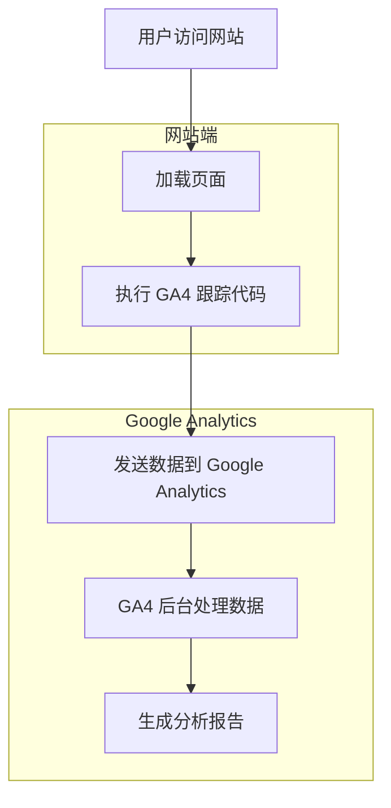

# Google Analytics 实施计划

## 项目概述

为 Hugo 网站添加 Google Analytics 4 (GA4) 访问统计功能，以便追踪网站访问数据。

## ✅ 实施状态

**已完成配置文件修改** - FixIt 主题原生支持 Google Analytics，只需配置即可使用。

## 技术背景

- **网站平台**: Hugo 静态网站生成器
- **部署平台**: GitHub Pages
- **当前主题**: FixIt
- **目标受众**: 全球用户
- **统计方案**: Google Analytics 4

## 实施架构



## 实施步骤

### 步骤 1: 注册 Google Analytics 4 账号

1. 访问 [Google Analytics](https://analytics.google.com/)
2. 使用 Google 账号登录
3. 创建新的 GA4 属性
4. 选择"网站"作为数据流类型
5. 输入网站 URL: `https://cygnusyang.github.io/`
6. 获取 Measurement ID（格式: `G-XXXXXXXXXX`）

### 步骤 2: 配置 Hugo 项目

在 [`cygnusyang.github.io/hugo.toml`](../cygnusyang.github.io/hugo.toml) 中添加 GA4 配置：

```toml
# Google Analytics 4
[params.analytics]
  enable = true
  id = "G-XXXXXXXXXX"  # 替换为实际的 Measurement ID
```

### 步骤 3: 创建 GA4 Partial 模板

创建文件 [`cygnusyang.github.io/layouts/_partials/analytics.html`](../cygnusyang.github.io/layouts/_partials/analytics.html)：

```html
{{- if .Site.Params.analytics.enable -}}
{{- $gaId := .Site.Params.analytics.id -}}
{{- if $gaId -}}
<!-- Google Analytics 4 -->
<script async src="https://www.googletagmanager.com/gtag/js?id={{ $gaId }}"></script>
<script>
  window.dataLayer = window.dataLayer || [];
  function gtag(){dataLayer.push(arguments);}
  gtag('js', new Date());
  gtag('config', '{{ $gaId }}');
</script>
{{- end -}}
{{- end -}}
```

### 步骤 4: 注入 GA4 代码到网站

有两种方式注入 GA4 代码：

#### 方式 A: 使用 FixIt 主题内置支持（推荐）

FixIt 主题原生支持 Google Analytics，只需在配置中添加：

```toml
[params.analytics]
  enable = true
  id = "G-XXXXXXXXXX"
```

主题会自动处理代码注入。

#### 方式 B: 使用自定义 partial（备选）

如果需要自定义控制，可以使用现有的自定义资源钩子机制：

在 [`cygnusyang.github.io/hugo.toml`](../cygnusyang.github.io/hugo.toml) 中修改：

```toml
[params.customPartials]
  assets = ["site-sidebar-nav-assets.html", "analytics.html"]
```

### 步骤 5: 本地测试

1. 构建网站：
   ```bash
   cd cygnusyang.github.io
   hugo server --buildDrafts
   ```

2. 使用浏览器开发者工具检查：
   - 打开 Network 面板
   - 刷新页面
   - 查找 `collect?v=2&tid=G-XXXXXXXXXX` 请求
   - 确认请求成功（状态码 200）

3. 使用 Google Analytics 实时报告：
   - 访问 GA4 后台
   - 进入"实时"报告
   - 刷新网站页面
   - 确认看到实时访问数据

### 步骤 6: 部署到 GitHub Pages

1. 提交更改：
   ```bash
   git add cygnusyang.github.io/hugo.toml
   git commit -m "Add Google Analytics 4"
   git push
   ```

2. GitHub Actions 会自动构建和部署

3. 等待部署完成后，访问网站验证

### 步骤 7: 验证数据上报

1. 在 GA4 后台查看"实时"报告
2. 等待 24-48 小时后查看标准报告
3. 验证以下数据是否正常：
   - 页面浏览量
   - 用户数
   - 会话数
   - 地理位置
   - 设备类型

## 配置文件修改清单

### 需要修改的文件

1. [`cygnusyang.github.io/hugo.toml`](../cygnusyang.github.io/hugo.toml)
   - 添加 `[params.analytics]` 配置

### 需要创建的文件

1. [`cygnusyang.github.io/layouts/_partials/analytics.html`](../cygnusyang.github.io/layouts/_partials/analytics.html)
   - GA4 跟踪代码模板

## 注意事项

### 隐私合规

- 考虑添加 Cookie 同意横幅
- 在隐私政策中说明使用 Google Analytics
- 考虑使用 IP 匿名化（GA4 默认不记录 IP）

### 性能影响

- GA4 脚本异步加载，对页面性能影响最小
- 考虑使用 `defer` 属性进一步优化

### 调试技巧

- 使用 Google Tag Assistant 浏览器扩展
- 使用 GA4 DebugView 进行实时调试
- 检查浏览器控制台是否有错误

## 替代方案

如果 Google Analytics 在国内访问有问题，可以考虑：

1. **百度统计** - 国内访问友好
2. **Cloudflare Web Analytics** - 无需额外脚本，隐私友好
3. **Plausible** - 开源，隐私友好
4. **Umami** - 自托管，完全控制数据

## 后续优化

- 设置自定义事件（如文章阅读完成）
- 配置转化目标
- 设置受众群体
- 集成 Google Search Console
- 创建自定义仪表板

## 参考资料

- [Google Analytics 4 文档](https://support.google.com/analytics/answer/9304153)
- [FixIt 主题文档 - Analytics](https://fixit.lruihao.cn/advanced/analytics/)
- [Hugo 内置模板](https://gohugo.io/templates/internal/)
