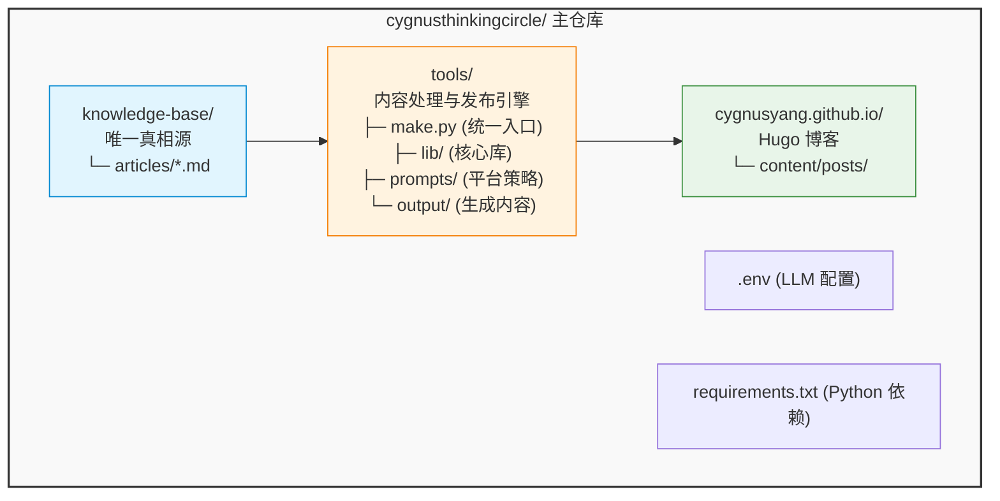
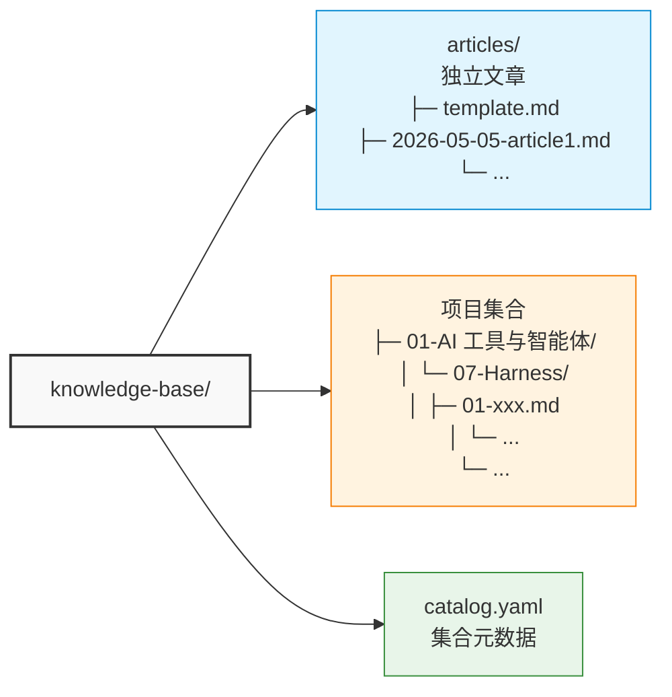
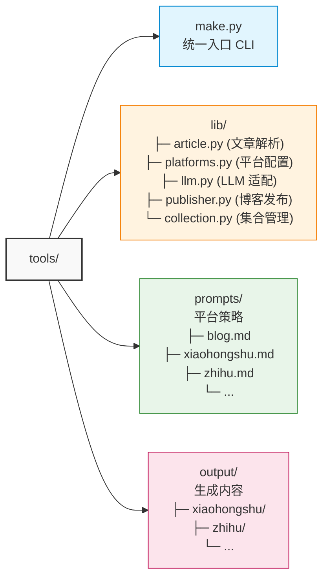
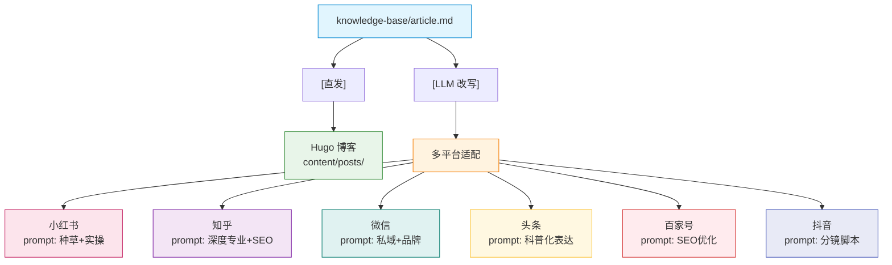
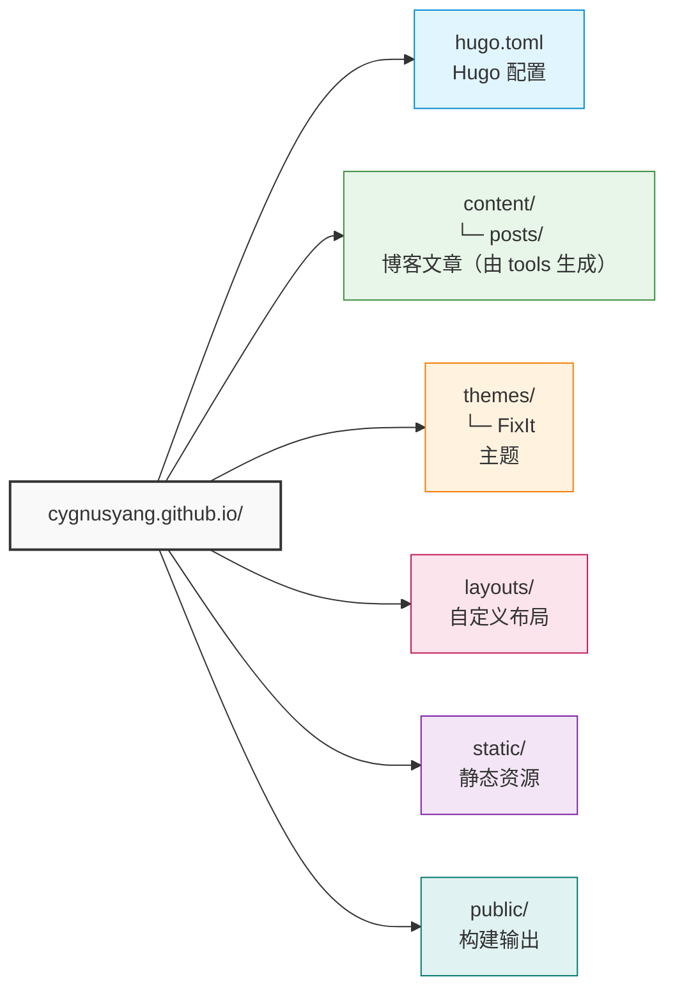
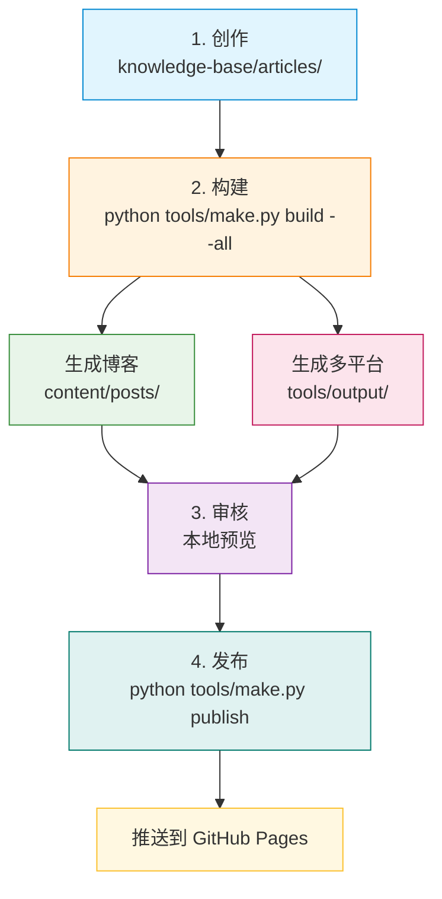
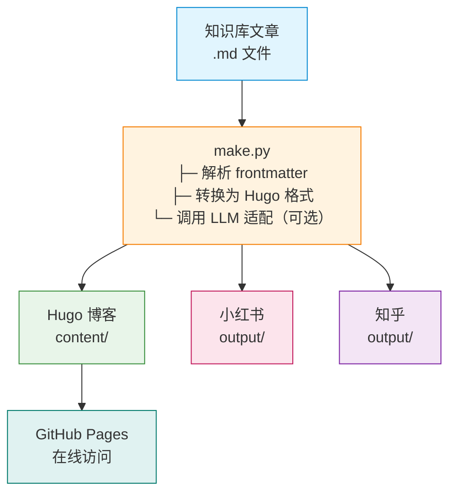

# 01. 系统架构

## 🏗️ 整体架构

## 📦 三层结构

### 1. 内容层 (knowledge-base/)

**唯一真相源** - 所有内容从这里开始

**特点：**
- 基于 Markdown，轻量级
- Frontmatter 定义元数据
- 支持项目集合管理
- Git 版本控制

### 2. 处理层 (tools/)

**内容处理与发布引擎**

**核心流程：**

### 3. 展示层 (cygnusyang.github.io/)

**Hugo GitHub Pages** - 作为 Git 子模块

**作为子模块的优势：**
- 独立的 Git 仓库
- 可以单独部署
- 清晰的职责分离

## 🔄 工作流程

## 🎯 关键设计原则

### 1. 单一真相源 (Single Source of Truth)

所有内容只在 `knowledge-base/` 维护，其他平台内容由工具自动生成。

### 2. 工具驱动

通过 `make.py` 统一入口，简化操作流程。

### 3. 可扩展性

- 新增平台：只需添加 `prompts/xxx.md` 和 `platforms.py` 配置
- 新增集合：按命名约定自动发现

### 4. 版本控制

所有内容通过 Git 管理，支持：
- 历史追溯
- 分支协作
- 回滚恢复

## 🛠️ 技术栈

| 层级 | 技术 | 用途 |
|------|------|------|
| 内容 | Markdown | 文档格式 |
| 处理 | Python 3.x | 自动化脚本 |
| LLM | Anthropic Claude | 内容适配 |
| 博客 | Hugo + FixIt | 静态站点生成器 |
| 托管 | GitHub Pages | 免费网站托管 |
| 版本 | Git | 版本控制 |

## 📊 数据流

## 🚀 扩展可能性

1. **新增平台**
   - 在 `tools/prompts/` 添加策略文件
   - 在 `tools/lib/platforms.py` 注册平台

2. **新增功能**
   - 评论系统 (Waline/Giscus)
   - 访问统计 (百度统计/Google Analytics)
   - 搜索功能 (Lunr.js/Algolia)

3. **自动化**
   - GitHub Actions 自动部署
   - 定时任务同步更新