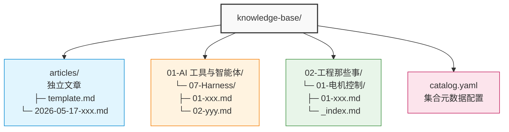

# 03. 知识库搭建

## 📁 知识库结构



## 📝 文章格式

### Frontmatter 说明

每个文章文件开头需要包含 YAML frontmatter：

```yaml
---
title: "文章标题"
date: 2026-05-17
tags: ["标签1", "标签2"]
category: "分类"
summary: "文章摘要"
keywords: ["关键词1", "关键词2"]
platforms: ["blog"]  # 发布平台：blog, xiaohongshu, zhihu, wechat, toutiao, baijiahao, douyin
---
```

### 模板文件

**独立文章模板** (`knowledge-base/articles/template.md`)：

```markdown
---
title: ""
date: 2026-05-17
tags: []
category: ""
summary: ""
keywords: []
platforms: ["blog"]
---

## 背景

[问题的背景和上下文]

## 核心概念

[核心概念、模型或框架的拆解]

## 实战

[具体操作、代码、案例]

## 判断

[你的观点和结论]
```

**集合文章模板** (`knowledge-base/articles/XX-项目名/template.md`)：

```markdown
---
title: ""
date: 2026-05-17
tags: []
category: ""
summary: ""
keywords: []
platforms: ["blog"]
collections: ["项目名"]  # 集合标识
---

## 章节内容

[章节内容]
```

## 🎯 集合管理

### 集合命名约定

集合目录按 `NN-项目名/` 命名，其中 `NN` 是两位数字编号：

```
01-AI 工具与智能体/
02-工程那些事/
03-研发那些事/
04-产品那些事/
08-codex/
```

嵌套集合也遵循相同规则：

```
04-研发那些事/
└── 01-电机控制/          # 嵌套集合
    └── blog/
        ├── 01-xxx.md
        └── _index.md    # 集合封面页
```

### 创建集合

```bash
# 1. 创建目录
mkdir -p "knowledge-base/articles/05-新项目"

# 2. 创建集合封面页
cat > "knowledge-base/articles/05-新项目/README.md" << 'EOF'
---
title: "新项目"
date: 2026-05-17
summary: "项目简介"
weight: 1
featuredImage: ""
---

这是新项目的介绍页面。
EOF

# 3. 创建模板（可选）
cp knowledge-base/articles/template.md "knowledge-base/articles/05-新项目/template.md"

# 4. 添加到 catalog.yaml（如果需要自定义配置）
```

### catalog.yaml 配置

```yaml
catalog:
  - slug: "ai-tools"
    name: "AI 工具与智能体"
    nn: 1
    description: "AI 工具、智能体和自动化系统的探索与实践"
    icon: "robot"

  - slug: "engineering"
    name: "工程那些事"
    nn: 2
    description: "工程实践中的经验与教训"
    icon: "tools"
```

## 🚀 内容操作

### 创建文章

**独立文章：**

```bash
python tools/make.py new "我的文章标题"
```

**集合文章：**

```bash
# 指定集合（支持模糊匹配）
python tools/make.py new "第一章 内容" --category "01-openclaw"
python tools/make.py new "第二章 内容" --category "openclaw"  # 简写也行
```

### 构建文章

```bash
# 构建所有文章（仅博客）
python tools/make.py build --all

# 构建单篇文章
python tools/make.py build 2026-05-17-article.md

# 构建指定平台的适配内容
python tools/make.py build --platform xiaohongshu,zhihu 2026-05-17-article.md

# 增量构建（只处理变更的文章）
python tools/make.py build --all --incremental

# 强制重新构建
python tools/make.py build --all --force
```

### 构建集合

```bash
# 列出所有集合
python tools/make.py collection list

# 构建单个集合
python tools/make.py collection build 01-openclaw

# 构建所有集合
python tools/make.py collection build --all

# 预览构建结果（不实际写入）
python tools/make.py collection build 01-openclaw --dry-run

# 指定源子目录（非 blog/ 的情况）
python tools/make.py collection build gstack --source blog/chapters
```

## 📊 内容状态查看

```bash
# 查看文章状态
python tools/make.py status

# 查看统计报表
python tools/make.py stats

# JSON 格式输出（用于自动化）
python tools/make.py stats --json

# 查看单个集合统计
python tools/make.py stats --collection openclaw
```

## ✅ 内容校验

```bash
# 校验所有 posts
python tools/make.py validate

# 校验单篇文章
python tools/make.py validate --article 2026-05-17-article.md
```

## 🎨 内容组织最佳实践

### 1. 文章命名

- **独立文章**：`YYYY-MM-DD-slug.md`
- **集合文章**：`NN-章节名.md`

### 2. 目录层级

- 集合不超过 3 层嵌套
- 集合内文章放在 `blog/` 子目录

### 3. Frontmatter 完整性

必填字段：
- `title` - 文章标题
- `date` - 发布日期
- `platforms` - 发布平台

推荐字段：
- `summary` - 文章摘要
- `tags` - 标签列表
- `collections` - 集合标识（集合文章）

### 4. 图片资源

图片放在 `cygnusyang.github.io/static/images/`：

```markdown

```

### 5. 代码块

使用三个反引号指定语言：

```markdown
```python
def hello():
    print("Hello, World!")
```
```

## 🔧 高级用法

### 1. 自定义模板

创建集合专属模板：

```bash
# 在集合目录创建 template.md
cat > "knowledge-base/articles/05-新项目/template.md" << 'EOF'
---
title: ""
date: 2026-05-17
tags: []
category: "新项目"
summary: ""
keywords: []
platforms: ["blog"]
collections: ["新项目"]

# 自定义 frontmatter 字段
author: "你的名字"
series: "系列名"
---

## 简介

[文章简介]

## 正文

[文章正文]

## 总结

[文章总结]
EOF
```

### 2. 批量导入

从其他平台导入文章：

```bash
# 1. 将 Markdown 文件放到 knowledge-base/articles/
# 2. 添加 frontmatter
# 3. 运行构建
python tools/make.py build --all
```

### 3. 迁移现有博客

```bash
# 1. 导出博客为 Markdown（使用工具如 jekyll-export）
# 2. 批量修改文件名和 frontmatter
# 3. 复制到 knowledge-base/articles/
# 4. 运行构建
python tools/make.py build --all
```

## 💡 下一步

- [04. GitHub Pages 搭建](./04-github-pages-setup.md) - 配置个人博客展示
- [06. 完整工作流](./06-complete-workflow.md) - 端到端演示