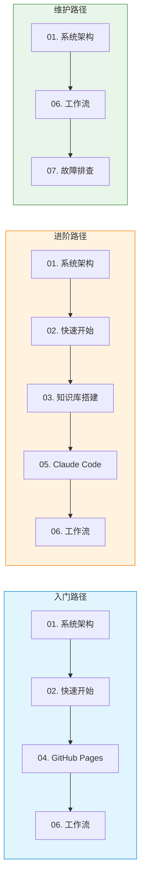
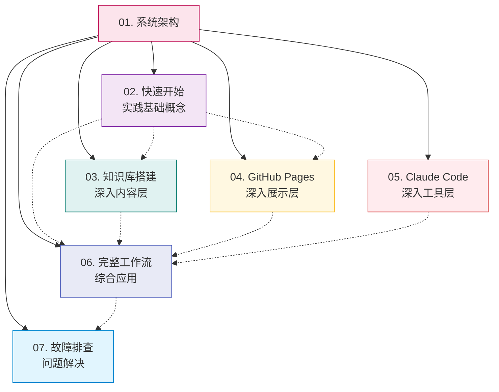

# 教程结构图

```mermaid
graph TB
    Root["tutorials/"]
    
    README["README.md<br/>教程入口"]
    Contributing["CONTRIBUTING.md<br/>贡献指南"]
    QuickRef["quick-reference.md<br/>快速参考卡片"]
    
    Arch["01-system-architecture.md<br/>系统架构<br/>├─ 整体架构图<br/>├─ 三层结构详解<br/>├─ 工作流程<br/>├─ 数据流<br/>└─ 技术栈"]
    
    Quick["02-quickstart.md<br/>快速开始<br/>├─ 前置条件<br/>├─ 克隆项目<br/>├─ 安装依赖<br/>├─ 配置 API<br/>├─ 创建文章<br/>├─ 编辑文章<br/>├─ 生成博客<br/>├─ 本地预览<br/>└─ 发布到 GitHub Pages"]
    
    KB["03-knowledge-base-setup.md<br/>知识库搭建<br/>├─ 目录结构<br/>├─ 文章格式<br/>├─ 集合管理<br/>├─ 内容操作<br/>└─ 最佳实践"]
    
    Pages["04-github-pages-setup.md<br/>GitHub Pages 搭建<br/>├─ 创建仓库<br/>├─ 初始化 Hugo<br/>├─ 配置主题<br/>├─ 功能增强<br/>├─ 自定义域名<br/>└─ 常见问题"]
    
    Claude["05-claude-code.md<br/>Claude Code 安装与使用<br/>├─ 安装指南<br/>├─ 认证配置<br/>├─ 基本使用<br/>├─ 权限管理<br/>├─ 插件与 Skills<br/>├─ 在本项目中的应用<br/>└─ 最佳实践"]
    
    Workflow["06-complete-workflow.md<br/>完整工作流<br/>├─ 从零创建文章<br/>├─ 本地预览<br/>├─ 生成多平台内容<br/>├─ 发布到 GitHub Pages<br/>├─ 集合文章工作流<br/>├─ 使用 Claude Code 辅助<br/>├─ 效率提升技巧<br/>└─ 进阶工作流"]
    
    Troubleshoot["07-troubleshooting.md<br/>故障排查<br/>├─ 文章构建问题<br/>├─ GitHub Pages 问题<br/>├─ LLM 适配问题<br/>├─ Hugo 主题问题<br/>├─ Python 环境问题<br/>├─ Claude Code 问题<br/>├─ 调试技巧<br/>└─ 问题解决清单"]
    
    VSCode[".vscode/<br/>└─ settings.json<br/>VS Code 配置"]
    
    Root --> README
    Root --> Contributing
    Root --> QuickRef
    Root --> Arch
    Root --> Quick
    Root --> KB
    Root --> Pages
    Root --> Claude
    Root --> Workflow
    Root --> Troubleshoot
    Root --> VSCode
    
    style Root fill:#f9f9f9,stroke:#333,stroke-width:2px
    style README fill:#e1f5fe,stroke:#0288d1
    style Contributing fill:#fff3e0,stroke:#f57c00
    style QuickRef fill:#e8f5e9,stroke:#388e3c
    style Arch fill:#fce4ec,stroke:#c2185b
    style Quick fill:#f3e5f5,stroke:#7b1fa2
    style KB fill:#e0f2f1,stroke:#00796b
    style Pages fill:#fff8e1,stroke:#fbc02d
    style Claude fill:#ffebee,stroke:#d32f2f
    style Workflow fill:#e8eaf6,stroke:#3f51b5
    style Troubleshoot fill:#fce4ec,stroke:#c2185b
    style VSCode fill:#f3e5f5,stroke:#7b1fa2
```

## 📚 学习路径

```mermaid
graph LR
    subgraph Beginner["入门路径"]
        B1["01. 系统架构"]
        B2["02. 快速开始"]
        B3["04. GitHub Pages"]
        B4["06. 工作流"]
        
        B1 --> B2 --> B3 --> B4
    end
    
    subgraph Advanced["进阶路径"]
        A1["01. 系统架构"]
        A2["02. 快速开始"]
        A3["03. 知识库搭建"]
        A4["05. Claude Code"]
        A5["06. 工作流"]
        
        A1 --> A2 --> A3 --> A4 --> A5
    end
    
    subgraph Maintenance["维护路径"]
        M1["01. 系统架构"]
        M2["06. 工作流"]
        M3["07. 故障排查"]
        
        M1 --> M2 --> M3
    end
    
    style Beginner fill:#e1f5fe,stroke:#0288d1
    style Advanced fill:#fff3e0,stroke:#f57c00
    style Maintenance fill:#e8f5e9,stroke:#388e3c
```

## 🔗 章节关系

```mermaid
graph TB
    Arch["01. 系统架构"]
    
    Quick["02. 快速开始<br/>实践基础概念"]
    KB["03. 知识库搭建<br/>深入内容层"]
    Pages["04. GitHub Pages<br/>深入展示层"]
    Claude["05. Claude Code<br/>深入工具层"]
    Workflow["06. 完整工作流<br/>综合应用"]
    Troubleshoot["07. 故障排查<br/>问题解决"]
    
    Arch --> Quick
    Arch --> KB
    Arch --> Pages
    Arch --> Claude
    Arch --> Workflow
    Arch --> Troubleshoot
    
    Quick -.-> KB
    Quick -.-> Pages
    Quick -.-> Workflow
    
    KB -.-> Workflow
    Pages -.-> Workflow
    Claude -.-> Workflow
    
    Workflow -.-> Troubleshoot
    
    style Arch fill:#fce4ec,stroke:#c2185b
    style Quick fill:#f3e5f5,stroke:#7b1fa2
    style KB fill:#e0f2f1,stroke:#00796b
    style Pages fill:#fff8e1,stroke:#fbc02d
    style Claude fill:#ffebee,stroke:#d32f2f
    style Workflow fill:#e8eaf6,stroke:#3f51b5
    style Troubleshoot fill:#e1f5fe,stroke:#0288d1
```